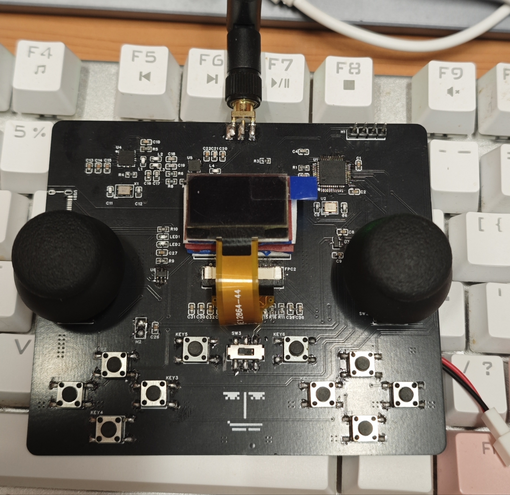

# 项目名称：NRF24L01遥控器
## 介绍：
- 该遥控器遥控部分采用NRF24L01无线收发芯片和AT2401C射频芯片组合的方案，主控芯片为STM32F103C8T6。
- 遥控器的原理图使用的是B站江科协的开源平衡车遥控器，器件布局也参考了江科协的遥控器实物。
- 该遥控器程序与我另一个开源的四轴无人机所适配的 ->
[FlyControl](https://github.com/vitaminHurricane/Balance_car)
## 原理图：
[原理图](schematic/SCH_Schematic.pdf)
## BOM清单：
[BOM清单](schematic/遥控器BOM.xlsx)
## 遥控器实物图：
左右两侧按钮用于改动菜单中光标位置，居中左右两侧按钮用于选中，中间开关为电源开关。由于我使用的是可拆卸电池为遥控器供电，所以没有焊接充电模块部分。

## 菜单功能：

