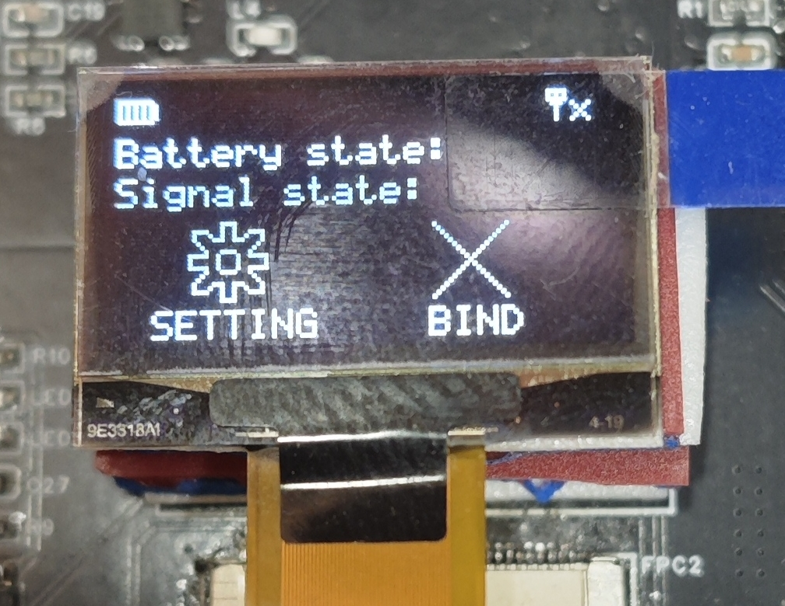

# 项目名称：NRF24L01遥控器
## 介绍：
- 该遥控器遥控部分采用NRF24L01无线收发芯片和AT2401C射频芯片组合的方案，主控芯片为STM32F103C8T6。
- 该遥控器程序与我另一个开源的四轴无人机所适配的 ->
[FlyControl](https://github.com/vitaminHurricane/FlyControl)
## 原理图：
遥控器的原理图使用的是B站江科协的开源平衡车遥控器
（[Up主开源资料](https://jiangxiekeji.com/download.html)），器件布局也参考了江科协的遥控器实物。

[遥控器原理图](schematic/SCH_Schematic.pdf)

## BOM清单：
[BOM清单](schematic/遥控器BOM.xlsx)
## 遥控器实物图：
左右两侧按钮用于改动菜单中光标位置，居中左右两侧按钮用于选中，中间开关为电源开关。由于我使用的是可拆卸电池为遥控器供电，所以没有焊接充电模块部分。

## 菜单功能：
- ### 主界面：
    左边是设置功能，右边是和飞机连接功能，顶部是电池信息和信号强度。因为没有ADC连接到电池，而且信号状态也不好数字化，所以舍弃了这两个功能，但是信号强度可以从右上角的图标判断(虽然说只能看有没有连接到飞机就是了，无法反馈信号强度)

- ### 一级菜单：
    1.第一个是通道测试，将打杆量可视化，判断能否正常读取摇杆数据。

    2.第二个是通道翻转功能，可以将摇杆数据翻转过来，设置后可以到通道测试观察打杆量的变化。

    3.第三个是飞机平衡点设置，通过遥控器设置飞机的平衡位置(还在做就是了)。

- ### 连接飞机的反馈：
- 连接成功的反馈；如图所示，显示成功，右上角信号图标显示连接成功。

- 连接失败的反馈：如图所示，显示失败。

